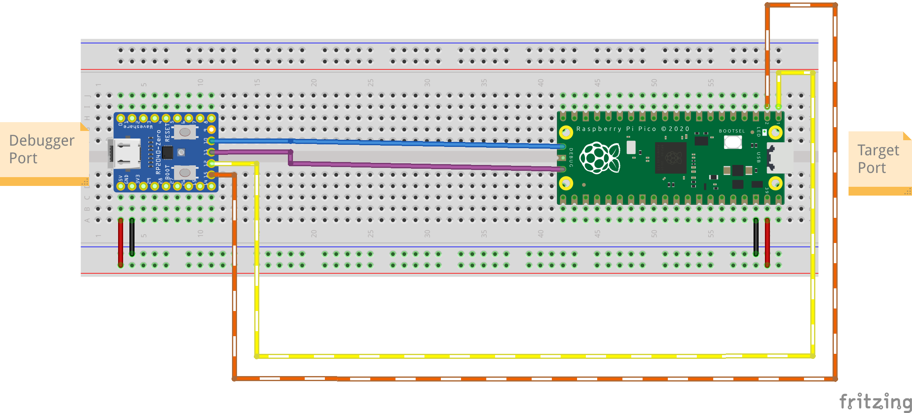

## Pinout

Check the [RPi Pico Pinout Labels](https://pico.pinout.xyz/)

| Zero PIN | Debugger Function | Notes | Pico PIN | Target Function |
|----------|-------------------|-------|----------|-----------------|
| 10       | CLK               |       | CLK      | SWCLK           |
| 11       | DIO               |       | DIO      | SWDIO           |
| 12       | UART0 TX          | [^1]  | 1        | UART0 RX        |
| 13       | UART0 RX          | [^1]  | 0        | UART0 TX        |

[^1]: Target pins depends on the setup of your target board

# How to use

- Download the UF2 firmware from the [Release](https://github.com/icpmoles/zeroprobe/releases) page.

- Flash it on the RP2040-Zero:

    - With the USB cable disconnected

    - Keep pressed the BOOT button

    - Connect the USB cable

    - An external memory device will appear

    - Drag and drop the `zephyr.uf2` file downloaded before

- Connect the two boards as shown above

- **[OPTIONAL]** Test with `pyOCD`

    - Install with `sudo apt install python3-pyocd`

    - Check the device with: `pyocd list`

    - A device will appear

## SWD/DAP

// todo 

## TTY

// todo

# Fixes

// todo

## TODO

- Use the addressable RGB LED to display information

# Credits

- [Zephyr RTOS](https://www.zephyrproject.org/)

- [DAPLink](https://github.com/armmbed/daplink)

- Images created with [Fritzing](https://fritzing.org/)

- Boards footprint created by Vanepp: [RP2040-Zero](https://forum.fritzing.org/t/part-request-waveshare-rp2040-zero/16705/2) & [RPi Pico](https://forum.fritzing.org/t/looking-for-raspberry-pi-pico-part/11915/19) 

# Footnotes